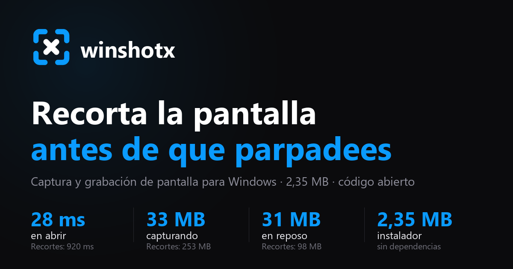
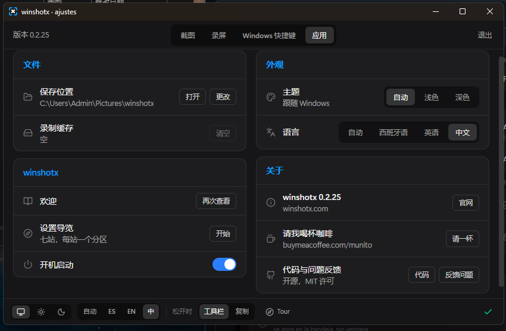

<div align="center">

**Español** · [English](README.md)



<br>

[](LICENSE)
[](#estado)
[](https://github.com/Mun1to/winshotx/releases/latest)
[](#instalación)
[](https://www.rust-lang.org)
[](https://tauri.app)

**[⬇ Descargar para Windows](https://github.com/Mun1to/winshotx/releases/latest/download/winshotx-setup.exe)**
&nbsp;·&nbsp;
**[▶ Probarla en el navegador](https://winshotx.com/)**
&nbsp;·&nbsp;
[Comparar con la Herramienta de Recortes](#herramienta-de-recortes-contra-winshotx)

</div>

---

Una **alternativa libre a la Herramienta de Recortes de Windows**: captura de región con lupa de
píxel, **grabación en GIF y MP4** y editor fotograma a fotograma. Abre la selección en 28 ms, gasta
33 MB de memoria y cabe en un instalador de 2,2 MB. Sin cuenta, sin nube, sin telemetría y sin
FFmpeg empaquetado.

> **La interfaz habla español e inglés**, y arranca en el que tenga puesto Windows. Se puede fijar
> uno de los dos en **Ajustes → La app → Aspecto**. Los identificadores y los comentarios del código
> están en español; los commits y la portada en inglés van aparte.

## Instalación

[**Descargar el instalador**](https://github.com/Mun1to/winshotx/releases/latest/download/winshotx-setup.exe)
· 2,2 MB · se instala solo para tu usuario, así que Windows no pide permisos de administrador. Las
versiones anteriores están en [Releases](../../releases).

Al abrirse vive en la bandeja del sistema, sin ventana. Windows esconde los iconos nuevos: si no lo
ves, está detrás de la flecha `^` de la barra de tareas.

**Se actualiza sola.** En **Ajustes → Actualizaciones** aparece el botón cuando hay versión nueva, y
con un clic se descarga, se instala y se reinicia. Las descargas van firmadas y la app comprueba la
firma antes de instalar nada, así que un archivo manipulado no entra.

## Qué hace

|  |  |
|---|---|
| 📸 **Captura de región** | Sobre la pantalla congelada, con lupa 6× que da el color exacto en hexadecimal y ajuste a las ventanas: un clic coge la ventana entera. |
| 🎬 **Grabación de la región** | A 15, 30 o 60 fps con Windows Graphics Capture, sin que se cuelen overlays en el vídeo. |
| ✂️ **Editor fotograma a fotograma** | Tira de miniaturas, recorte A/B, reproducción en bucle, escala con proporción bloqueada y control de calidad. |
| 💾 **Exportación** | GIF, MP4 o PNG, a disco y al portapapeles: la imagen se pega como imagen y el GIF o el MP4 se pegan como **archivo** en Slack, Discord o el Explorador. |
| ⏪ **Los últimos segundos** | Graba siempre, tira lo viejo, y con una tecla se queda con los últimos 15, 30 o 60 segundos. Lo bueno de una pantalla casi siempre pasa **antes** de que a nadie se le ocurra grabarla. |
| 🔊 **Audio del sistema** | Lo que suena por tus altavoces entra en el MP4, cogido de la salida por defecto. Sin instalar nada, y lo sigues oyendo mientras se graba. |
| ⏱️ **Capturar con espera** | 3 o 5 segundos antes de que se congele la pantalla, con la cuenta atrás en el centro. Es la única forma de fotografiar un menú abierto, porque al pulsar el atajo se cierra. |
| 🌓 **Claro y oscuro** | Sigue el tema de Windows y cambia con él, o fijas el que quieras. |
| 🔒 **Todo local** | Ni cuenta, ni telemetría, ni subidas. La única llamada a la red es mirar si hay versión nueva en GitHub. |



## Herramienta de Recortes contra winshotx

Mismo equipo con Windows 11, tres pasadas cada una y las dos arrancando desde cero. El cronómetro
para cuando la selección ya se ve en pantalla. La
[tabla entera](https://winshotx.com/#frente-a-frente) tiene las diecinueve filas,
incluidas las cinco que gana la de Windows.

| | winshotx | Herramienta de Recortes |
|---|---|---|
| Del atajo a la selección | **28 ms** | 920 ms |
| Memoria mientras capturas | **33 MB** | 253 MB |
| Memoria esperando quieta | **31 MB** | 98 MB |
| Graba GIF | **sí** | no |
| Editor fotograma a fotograma | **sí** | no |
| Elegir el atajo de teclado | **sí** | no |
| Dibujar y anotar encima | no | **sí** |
| Copiar el texto de la imagen | no | **sí** |
| Audio del sistema al grabar | todavía no | **sí** |
| Temporizador antes de capturar | no | **sí** |

## ¿Es esto lo que buscabas?

- **"Quiero algo mejor que la Herramienta de Recortes."** Es esto, y se abre 33 veces antes. La de
  Windows sigue ganando en anotar, en leer el texto de la imagen y en el audio del sistema, y la
  tabla de arriba lo dice.
- **"¿Cómo grabo un GIF de la pantalla en Windows?"** Pulsa `Ctrl+Shift+5`, arrastra sobre la zona,
  púlsalo otra vez para parar y exporta a GIF desde el editor. Sin instalar FFmpeg.
- **"Necesito un grabador de pantalla ligero."** 33 MB mientras captura y 31 esperando en la
  bandeja.
- **"Algo como ShareX o CleanShot X, pero más simple."** Los mismos atajos globales y el mismo
  overlay sobre la pantalla congelada, sin cientos de ajustes.
- **"Quiero sacar un color de la pantalla."** La lupa te da el hexadecimal del píxel bajo el cursor
  con zoom 6×.
- **"¿Sube mis capturas a algún sitio?"** No. Ni cuenta, ni telemetría, ni más red que mirar si hay
  versión nueva en GitHub.

## Atajos

| Atajo | Acción |
|---|---|
| `Ctrl+Shift+2` | Capturar región |
| `Ctrl+Shift+5` | Grabar región · púlsalo otra vez para terminar |
| `Ctrl+Shift+6` | Quedarte con lo último que pasó · mientras «los últimos segundos» esté encendido |
| `Impr Pant` | Capturar región · si le quitas la tecla a la Herramienta de Recortes |
| `Enter` | Copiar la selección al portapapeles |
| `Ctrl+S` | Guardar la selección |
| `E` | Abrir la selección en el editor |
| `A` | Anclar la selección: se queda flotando encima de todo, en su sitio |
| `T` | Copiar el texto de la selección, leído por el lector de Windows |
| `G` / `V` | Grabar la selección como GIF / vídeo |
| `Ctrl+A` | Seleccionar el monitor entero |
| `←↑→↓` | Mover la selección · con `Shift` de 10 en 10 · con `Alt` redimensiona |
| `Esc` | Cancelar |

En el editor: `espacio` reproduce, `I` y `O` marcan inicio y final del recorte, `←` `→` avanzan
fotograma a fotograma, `Ctrl+S` exporta con los ajustes del panel y `Esc` cierra.

En el editor, para anotar: `1` flecha, `2` rectángulo, `3` texto, `4` resaltar, `5` paso numerado
y `6` tapar datos. `Ctrl+Z` deshace la última marca. Los pasos se numeran solos, así que meter uno
en medio no deja dos treses en la misma imagen.

Los dos atajos globales se cambian desde Ajustes pulsando el campo y tecleando la combinación
nueva. Si otra aplicación ya la tiene cogida, el campo se pone rojo y avisa.

La tecla `Impr Pant` la tiene la Herramienta de Recortes por un valor del registro del usuario, así
que registrar el atajo por su cuenta parece funcionar y luego no llega ninguna pulsación. El
interruptor de Ajustes apaga ese valor y coge la tecla, y al desactivarlo lo deja como estaba.
`Win+Mayús+S` la atiende Windows por delante de cualquier programa, hook o atajo. Lo único que se la
quita es apagar la S en `DisabledHotkeys`, y eso hace el mismo interruptor: cuesta perder `Win+S`, la
búsqueda, y al desactivarlo se devuelve todo tal cual. Esa lista la lee el escritorio solo al
arrancar, así que hace falta que vuelva a arrancar: el botón **Aplicar** de esa misma fila reinicia
el Explorador, que tarda dos segundos y no cierra nada, en vez de obligar a cerrar sesión. Si se
prefiere quitar la Herramienta de Recortes entera, la app abre la pantalla de Windows donde se
desinstala, pero nunca desinstala nada por su cuenta.

## Dos formas de capturar

Las dos usan el mismo atajo y la misma selección. Lo que cambia es el momento de soltar:

| Perfil | Qué pasa al soltar el ratón |
|---|---|
| **Sale la barra** | Aparece una barra sobre la selección: copiar, guardar, editar |
| **Se copia sola** | No aparece nada · la imagen ya está en el portapapeles |

El perfil se elige en la bienvenida del primer arranque, y se cambia cuando quieras desde Ajustes.

## Qué sale del recorte, y de qué pantalla

Arriba y en el centro, donde Windows pone la suya, hay una barra con cuatro botones. Los tres
primeros dicen **qué sale**: foto, vídeo o GIF, elegido antes de recortar y con las teclas `F`,
`V` y `G`. El cuarto dice **de dónde**: al pulsarlo, cada monitor saca su propio número en el
centro, y con `1`, `2` o `3` te llevas esa pantalla entera, esté donde esté el ratón en ese
momento. Un clic sobre la pantalla hace lo mismo.

Grabar respeta el perfil: con «se copia sola» arranca al soltar, y con «sale la barra» te deja
ajustar el recuadro antes, porque equivocarse en una grabación cuesta minutos y no una tecla.

<details>
<summary><b>Cómo está construido</b></summary>

<br>

| Capa | Elección | Por qué |
|---|---|---|
| Escritorio | [Tauri 2](https://tauri.app) | binario pequeño, webview del sistema, backend en Rust |
| Actualización | plugin `updater` de Tauri, firmas minisign | un botón, sin salir de la app y sin instalar nada a ciegas |
| Interfaz | React 19 + Vite + Tailwind 4 + framer-motion | ventanas independientes, animación nativa |
| Captura estática | [`xcap`](https://crates.io/crates/xcap) | enumera monitores y ventanas con sus coordenadas reales |
| Grabación | [`windows-capture`](https://crates.io/crates/windows-capture) | Windows Graphics Capture, 60 fps sin coste de CPU |
| MP4 | Media Foundation, H.264 por hardware | 0 MB de dependencias, aceleración del sistema |
| GIF | [`gif`](https://crates.io/crates/gif) + [`color_quant`](https://crates.io/crates/color_quant) | paleta global, dithering y diferencia entre fotogramas |
| Caché de edición | [QOI](https://qoiformat.org) sin pérdida | rápido de escribir y editable fotograma a fotograma |

**El overlay de selección no es una ventana transparente.** Se captura la pantalla, se muestra
congelada y se selecciona encima. Esquiva el bug de transparencia de Tauri v2 en Windows, elimina el
parpadeo del contenido en movimiento y regala una lupa exacta al píxel.

**Nada de FFmpeg empaquetado.** El MP4 lo escribe Media Foundation por hardware y el GIF se genera
en Rust puro con paleta global, dithering Floyd-Steinberg y escritura solo del rectángulo que cambia
entre fotogramas. Si tienes `ffmpeg` en el `PATH`, el editor ofrece además un motor de máxima
calidad (`palettegen`), pero nunca se descarga ni se distribuye.

[`docs/TRAMPAS.md`](docs/TRAMPAS.md) recoge las siete trampas de Tauri v2 en Windows que costaron
horas: comandos síncronos que congelan la interfaz, ventanas que no se pueden crear desde el hilo de
un atajo global, etiquetas de ventana que no se reutilizan, el primer clic que se come el sistema,
un canvas contaminado por el protocolo `asset:`, una CSP incompleta que solo falla en el instalador
y la clave de firma que se pasa de una forma y no de otra.

</details>

<details>
<summary><b>Desarrollo</b></summary>

<br>

```bash
pnpm install
pnpm approve-builds --all
pnpm tauri dev      # arranca la app (vive en la bandeja del sistema)
pnpm tauri build    # instalador NSIS en target/release/bundle/nsis
```

Las pruebas del backend no son de mentira: capturan la pantalla real, graban un clip con Windows
Graphics Capture y exportan GIF y MP4 que luego se vuelven a leer para comprobar que son válidos.

```bash
cd src-tauri
cargo test
```

La página está en [`frontlaxweb/`](frontlaxweb) y la sirve Cloudflare Pages. Cada push pasa las
comprobaciones y solo entonces despliega, así que el inglés, las huellas de los archivos y el
sitemap tienen que cuadrar primero:

```bash
node frontlaxweb/generar-en.mjs      # rehace /en/, el bloque de preguntas y las huellas
python frontlaxweb/generar-social.py # rehace las dos tarjetas de 1200x630
```

Para publicar una versión hace falta la clave privada de firma, que **no está en el repositorio** y
sin la cual el actualizador no aceptaría la descarga:

```bash
export TAURI_SIGNING_PRIVATE_KEY="$(cat ~/.tauri/winshotx.key)"
export TAURI_SIGNING_PRIVATE_KEY_PASSWORD=""   # la clave se generó sin contraseña
pnpm tauri build
node scripts/publicar.mjs --publicar   # prepara latest.json y crea la release
```

`publicar.mjs` se niega a seguir si `package.json` y `Cargo.toml` no dicen la misma versión, o si el
`.sig` es más viejo que el instalador, que es lo que pasa cuando compilas sin la clave.

Los manifiestos de winget están en [`packaging/winget`](packaging/winget).

</details>

## Estado

Funciona en Windows 10 1903 o superior. macOS y Linux compilan, pero toda función específica de
plataforma devuelve "esta función solo está implementada en Windows": captura, grabación,
codificación MP4, portapapeles y arranque automático están detrás de `#[cfg(windows)]` con un stub
para el resto, así que portarlo es rellenar esos stubs.

**Lo que falta:** el audio del sistema todavía no se graba. Necesita WASAPI en modo loopback para
alimentar el codificador; el interruptor ya está en la interfaz, desactivado y diciéndolo. Anotar
encima de una captura, leer el texto de la imagen y el temporizador tampoco están, y la comparativa
de arriba lo dice.

## Licencia

[MIT](LICENSE). Úsalo, cámbialo y véndelo si quieres. Hecho por
[Munir Torres](https://munito.dev).
