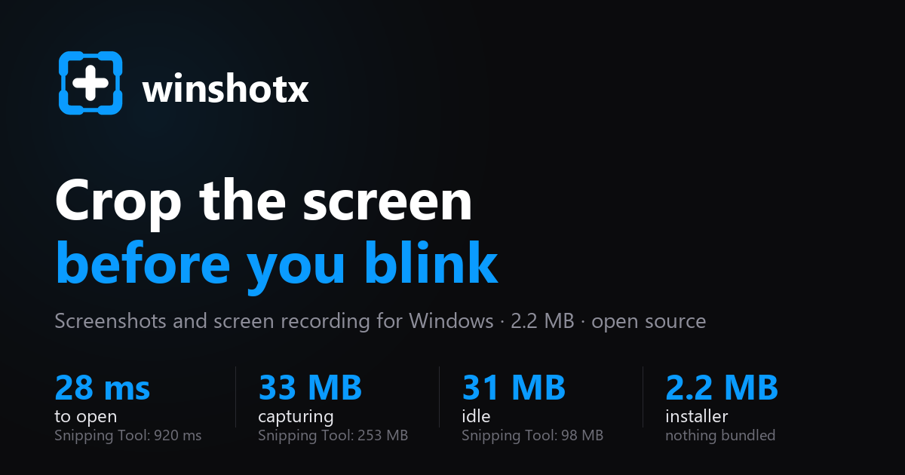

<div align="center">

**English** · [Español](README.es.md)



<br>

[](LICENSE)
[](#status)
[](https://github.com/Mun1to/winshotx/releases/latest)
[](#install)
[](https://www.rust-lang.org)
[](https://tauri.app)

**[⬇ Download for Windows](https://github.com/Mun1to/winshotx/releases/latest/download/winshotx-setup.exe)**
&nbsp;·&nbsp;
**[▶ Try it in your browser](https://winshotx.com/en/)**
&nbsp;·&nbsp;
[Compare with the Snipping Tool](#snipping-tool-against-winshotx)

</div>

---

A free and open source **Snipping Tool alternative for Windows**: region screenshots with a pixel
magnifier, **GIF and MP4 screen recording**, and a frame by frame editor. It opens the selection in
28 ms, uses 33 MB of memory and fits in a 2.2 MB installer. No account, no cloud, no telemetry and
no bundled FFmpeg.

> **The interface speaks English and Spanish**, and follows whichever one Windows is set to. You
> can pin it to either in **Settings → The app → Appearance**. The identifiers and comments in the
> source are in Spanish; the commits, this page and the
> [home page](https://winshotx.com/en/) are in English.

## Install

[**Download the installer**](https://github.com/Mun1to/winshotx/releases/latest/download/winshotx-setup.exe)
· 2.2 MB · it installs for your user only, so Windows never asks for administrator rights. Older
versions are in [Releases](../../releases).

It lives in the system tray with no window of its own. Windows hides new tray icons, so if you
cannot see it, look behind the `^` arrow on the taskbar.

**It updates itself.** In **Settings → The app → Updates** a button shows up when a new version is out,
and one click downloads it, installs it and restarts the app. Every download is signed and the
signature is checked before anything is installed, so a tampered file is rejected.

## What it does

|  |  |
|---|---|
| 📸 **Region capture** | Over a frozen screenshot, with a 6× magnifier that shows the exact colour in hex and snapping to system windows: one click takes the whole window. |
| 🎬 **Region recording** | 15, 30 or 60 fps through Windows Graphics Capture, with no overlays leaking into the video. |
| ✂️ **Frame by frame editor** | Thumbnail strip, A/B trimming, looped playback, scaling with locked aspect ratio and a quality control. |
| 💾 **Export** | GIF, MP4 or PNG, to disk and to the clipboard: an image pastes as an image, and a GIF or MP4 pastes as a **file** into Slack, Discord or Explorer. |
| 🔊 **System audio** | What comes out of your speakers goes into the MP4, captured straight from the default output. No extra driver, and you keep hearing it while it records. |
| ⏱️ **Shoot on a timer** | Wait 3 or 5 seconds before the screen freezes, with the countdown in the middle of the screen. It is the only way to photograph an open menu, because pressing the shortcut closes it. |
| 🌓 **Light and dark** | It follows the Windows theme and changes with it, or you pin the one you want. |
| 🔒 **Everything stays local** | No account, no telemetry, no uploads. The only network call is checking GitHub for a new version. |


## Snipping Tool against winshotx

Same machine with Windows 11, three runs each, both starting from cold. The clock stops when the
selection is actually on screen. The [full table](https://winshotx.com/en/#frente-a-frente)
has the nineteen rows, including the six the Snipping Tool wins.

| | winshotx | Snipping Tool |
|---|---|---|
| From shortcut to selection | **28 ms** | 920 ms |
| Memory while capturing | **33 MB** | 253 MB |
| Memory sitting idle | **31 MB** | 98 MB |
| Records GIF | **yes** | no |
| Frame by frame editor | **yes** | no |
| Pick your own shortcut | **yes** | no |
| Draw and annotate on top | no | **yes** |
| Copy the text out of the image | no | **yes** |
| System audio when recording | not yet | **yes** |
| Timer before capturing | no | **yes** |

## Is this what you were looking for?

- **"I want a Snipping Tool alternative for Windows."** This is it, and it is 33 times faster to
  open. The Snipping Tool still wins at annotating, text recognition and system audio, and the
  table above says so.
- **"How do I record a GIF of my screen on Windows?"** Press `Ctrl+Shift+5`, drag over the area,
  press it again to stop, and export to GIF from the editor. No FFmpeg to install.
- **"I need a lightweight screen recorder that does not eat my RAM."** 33 MB while capturing,
  31 MB waiting in the tray.
- **"Something like ShareX or CleanShot X, but simpler."** The same global shortcuts and the same
  frozen-screen overlay, without the hundreds of settings.
- **"I want to pick a colour off the screen."** The magnifier gives you the hex code of the pixel
  under the cursor at 6× zoom.
- **"Does it upload my screenshots anywhere?"** No. There is no account, no telemetry and no
  network calls other than checking for updates on GitHub.

## Shortcuts

| Shortcut | Action |
|---|---|
| `Ctrl+Shift+2` | Capture a region |
| `Ctrl+Shift+5` | Record a region · press again to stop |
| `Print Screen` | Capture a region · once you take the key from the Snipping Tool |
| `Enter` | Copy the selection to the clipboard |
| `Ctrl+S` | Save the selection |
| `E` | Open the selection in the editor |
| `G` / `V` | Record the selection as GIF / video |
| `Ctrl+A` | Select the whole monitor |
| `←↑→↓` | Move the selection · `Shift` for steps of 10 · `Alt` resizes |
| `Esc` | Cancel |

In the editor: `space` plays, `I` and `O` mark the start and end of the trim, `←` `→` step through
frames, `Ctrl+S` exports with whatever the panel has set, and `Esc` closes.

Both global shortcuts can be changed in the settings by clicking the field and typing the new
combination. If another application already holds it, the field turns red and says so.

`Print Screen` belongs to the Snipping Tool through a per-user registry value, so registering the
hotkey alone looks like it worked and never fires. The switch in the settings clears that value and
takes the key, and turning it off puts the value back exactly as it was. `Win+Shift+S` is attended by Windows
ahead of any program, hook or hotkey. The only thing that takes it away is turning the S off in
`DisabledHotkeys`, which the same switch does: it costs `Win+S`, the search, and switching it off puts
everything back as it was. The desktop only reads that list when it starts, so it has to start again:
the **Aplicar** button on that row restarts Explorer, which takes two seconds and closes nothing,
instead of making anyone sign out. For removing the Snipping
Tool altogether, the app opens the Windows screen where that is done, and never uninstalls anything
by itself.

## Two ways to capture

Both use the same shortcut and the same selection. What changes is the moment you let go:

| Profile | What happens when you release the mouse |
|---|---|
| **Sale la barra** | A toolbar appears over the selection: copy, save, edit |
| **Se copia sola** | Nothing appears · the image is already in the clipboard |

The profile is picked in the welcome on the first run, and changed any time in the settings.

## What comes out of the crop, and from which screen

At the top centre, where Windows puts its own, there is a bar with four buttons. The first three
say **what comes out**: photo, video or GIF, picked before cropping and bound to `F`, `V` and `G`.
The fourth says **where from**: press it and every monitor puts its own number in the middle, and
`1`, `2` or `3` takes that whole screen, wherever the pointer happens to be. Clicking the screen
does the same.

Recording honours the profile: with "se copia sola" it starts the moment you let go, and with
"sale la barra" it lets you adjust the rectangle first, because getting a recording wrong costs
minutes rather than one keystroke.

<details>
<summary><b>How it is built</b></summary>

<br>

| Layer | Choice | Why |
|---|---|---|
| Desktop | [Tauri 2](https://tauri.app) | small binary, system webview, Rust backend |
| Updates | Tauri `updater` plugin, minisign signatures | one button, without leaving the app or installing blind |
| Interface | React 19 + Vite + Tailwind 4 + framer-motion | independent windows, native feeling animation |
| Still capture | [`xcap`](https://crates.io/crates/xcap) | enumerates monitors and windows with their real coordinates |
| Recording | [`windows-capture`](https://crates.io/crates/windows-capture) | Windows Graphics Capture, 60 fps at no CPU cost |
| MP4 | Media Foundation, hardware H.264 | 0 MB of dependencies, system acceleration |
| GIF | [`gif`](https://crates.io/crates/gif) + [`color_quant`](https://crates.io/crates/color_quant) | global palette, dithering and frame differencing |
| Editing cache | lossless [QOI](https://qoiformat.org) | fast to write and editable frame by frame |

**The selection overlay is not a transparent window.** The screen is captured, shown frozen, and
the selection happens on top of that image. It sidesteps the Tauri v2 transparency bug on Windows,
removes the flicker of moving content underneath, and gives a pixel exact magnifier for free.

**No bundled FFmpeg.** MP4 is written by Media Foundation in hardware, and the GIF is produced in
pure Rust with a global palette, Floyd-Steinberg dithering and writing only the rectangle that
changed between frames. If you happen to have `ffmpeg` on your `PATH`, the editor offers a maximum
quality engine (`palettegen`) as well, but it is never downloaded and never shipped.

[`docs/TRAMPAS.md`](docs/TRAMPAS.md) (in Spanish) collects the seven Tauri v2 traps on Windows that
cost hours of debugging: synchronous commands that freeze the interface, windows that must not be
created from a global shortcut thread, window labels that cannot be reused, the first click being
eaten by the system, a canvas tainted by the `asset:` protocol, an incomplete CSP that only shows up
in the installer, and the signing key that is passed one way and not the other.

</details>

<details>
<summary><b>Development</b></summary>

<br>

```bash
pnpm install
pnpm approve-builds --all
pnpm tauri dev      # starts the app (it lives in the system tray)
pnpm tauri build    # NSIS installer in target/release/bundle/nsis
```

Backend tests are not pretend: they capture the real screen, record a clip through Windows Graphics
Capture and export GIF and MP4 files that are then read back to check they are valid.

```bash
cd src-tauri
cargo test
```

The site lives in [`frontlaxweb/`](frontlaxweb) and Cloudflare Pages serves it. Every push runs
the checks and then deploys, so the English pages, the asset hashes and the sitemap all have to
agree first:

```bash
node frontlaxweb/generar-en.mjs      # rebuild /en/, the FAQ schema and the asset hashes
python frontlaxweb/generar-social.py # rebuild both 1200x630 cards
```

Publishing a version needs the private signing key, which is **not in this repository** and without
which the updater would reject the download:

```bash
export TAURI_SIGNING_PRIVATE_KEY="$(cat ~/.tauri/winshotx.key)"
export TAURI_SIGNING_PRIVATE_KEY_PASSWORD=""   # the key was generated without one
pnpm tauri build
node scripts/publicar.mjs --publicar   # writes latest.json and creates the release
```

`publicar.mjs` refuses to run if `package.json` and `Cargo.toml` disagree on the version, or if the
`.sig` is older than the installer, which is what happens when you build without the key.

The winget manifests are in [`packaging/winget`](packaging/winget).

</details>

## Status

Runs on Windows 10 1903 or newer. macOS and Linux compile, but every platform specific function
returns "esta función solo está implementada en Windows": capture, recording, MP4 encoding,
clipboard and autostart are all behind `#[cfg(windows)]` with a stub for everything else, so
porting means filling those stubs in.

**What is missing:** system audio is not recorded yet. It needs WASAPI in loopback mode to feed the
encoder; the switch is already in the interface, disabled and saying so. Annotating on top of a
capture, text recognition and a timer are not there either, and the comparison above says so.

## License

[MIT](LICENSE). Use it, change it and sell it if you want. Built by
[Munir Torres](https://munito.dev).
